# Wallpapr

Inspired by Flickr, Wallpapr is an image sharing app where users can share their favorite desktop wallpapers as well as view other users' uploads and profiles. Users can interact with other users by leaving comments on their profile.

- [Live Site](https://wall-papr.herokuapp.com/)
- [MVP Feature List](https://github.com/Kxvin1/wallpapr/wiki/MVP-Feature-List)
- [Database Schema](https://github.com/Kxvin1/wallpapr/wiki/Database-Schema)

**_Recommended resolution size: 1920 x 1080 or higher_**

# Technologies Used

## Hosting

 

## Backend

  

## Frontend

  

# Getting started

1. Clone this repository

   `git clone git@github.com:Kxvin1/wallpapr.git`

2. Install dependencies in the `backend` directory

   `npm install`

3. Install dependencies in the `frontend` directory

   `npm install`

4. Create a .env file based on the .env.example given

5. Create a User in PSQL based on your .env DB_USERNAME

   `psql -c "CREATE USER <username> PASSWORD '<password>' CREATEDB"`

6. Create the database, migrate, and then seed

   `npx dotenv sequelize db:create`

   `npx dotenv sequelize db:migrate`

   `npx dotenv sequelize db:seed:all`

7. Start a server in both the `backend` and `frontend` directories by running:

   `npm start`

# Features

## Splash Page & User Authentication

- The splash page shows when a user is not currently logged in.

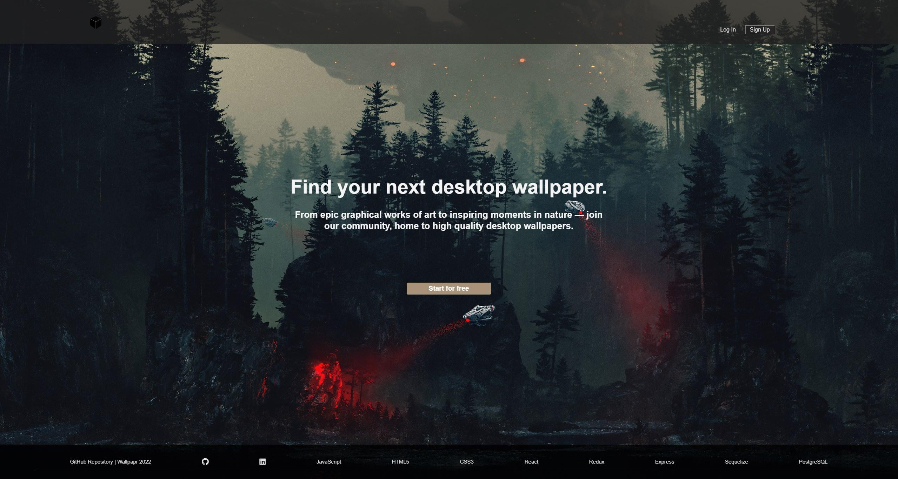

- Users can log into an existing account or sign up. Alternatively, users can test the site with the Demo Login feature.
- The bar at the top with the logo, login and sign up buttons is the navigation bar of a user who is not signed in.
- **Note: Upload feature is currently disabled (on purpose) for any account that isn't the dev's account**

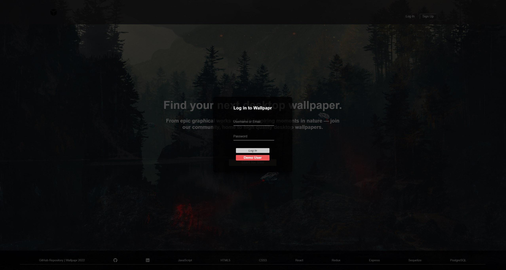

## User Home Page

### Navigation

- Once the user is logged in, the user's navigation bar changes and they can also view all images posted on the Discover page.

- They will also gain access to an Uploads page, where they can view, edit, and delete images they've uploaded. And the other page is the Profile page (explained in User Profile section).

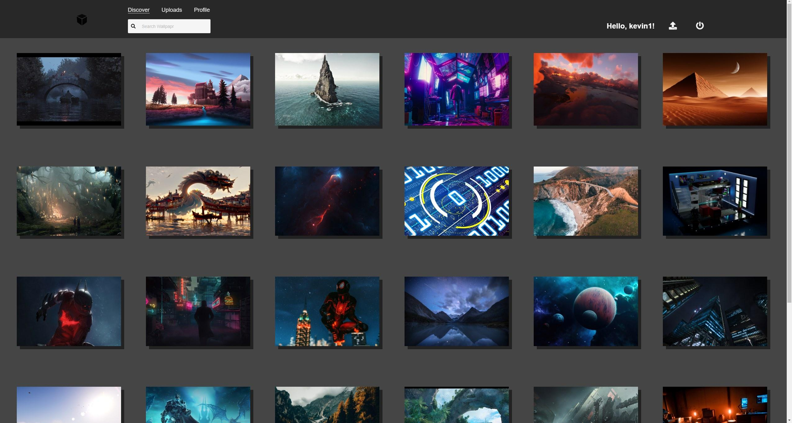

- Clicking on an image will display a zoomed in modal of that image, with the image's tags and a clickable link to the profile of the user who uploaded the image.

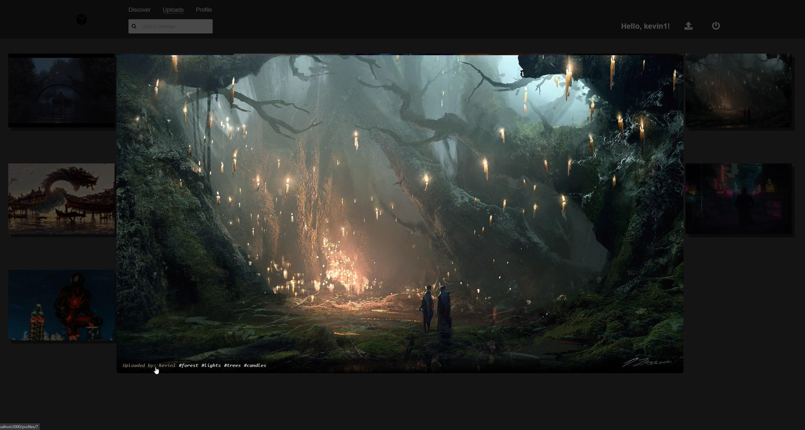

- Clicking on the username shows the portfolio of the user (shown further below)

## User Uploads

- A user can post a new image by clicking the upload icon (arrow pointing up, next to the log out button) in the navigation bar.

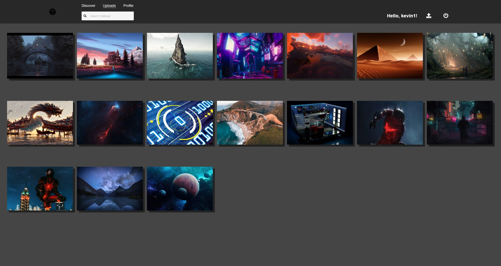

- New Image Modal

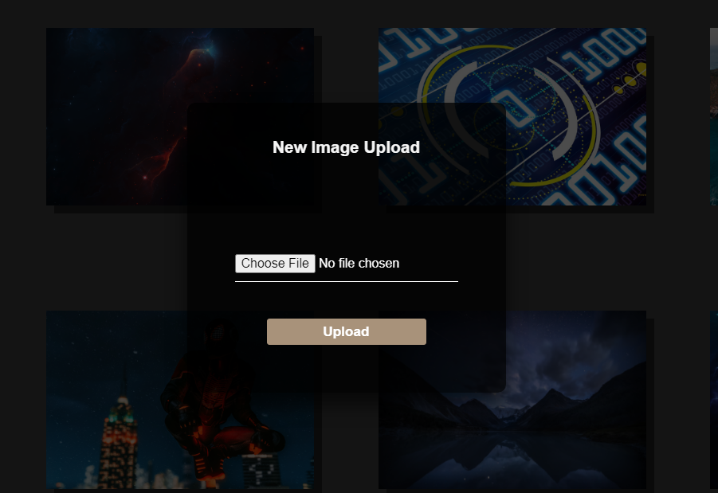

- Edit and delete buttons only show up on the Profile page and only on hover to achieve a clean look on the site.

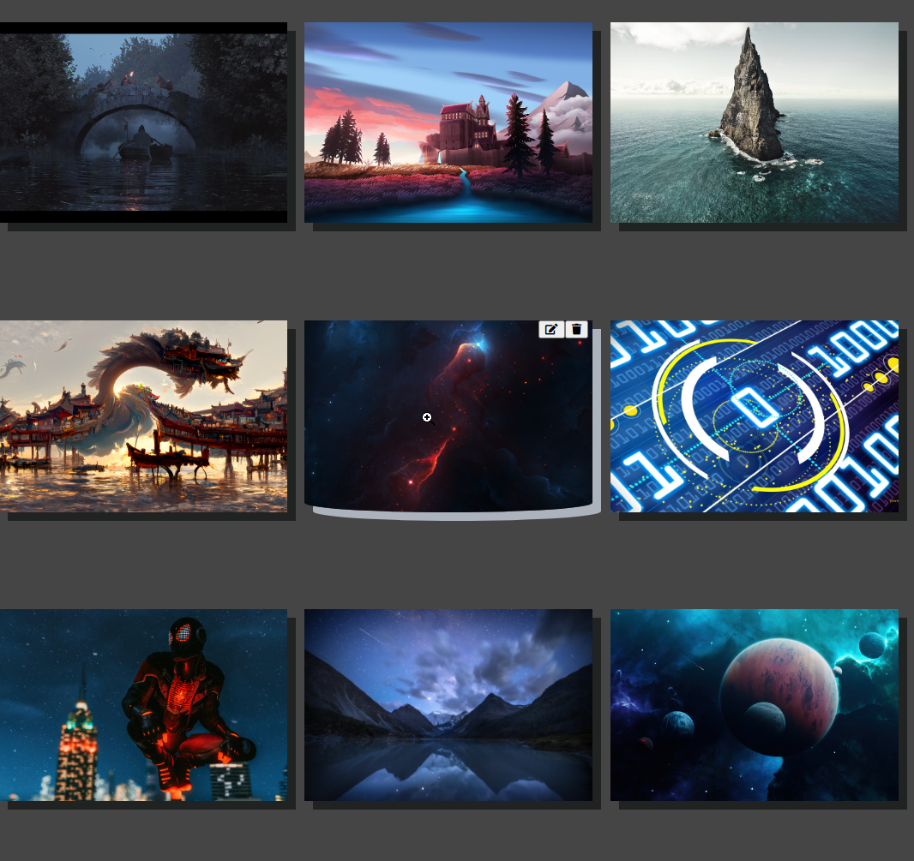

- Edit Tags Modal

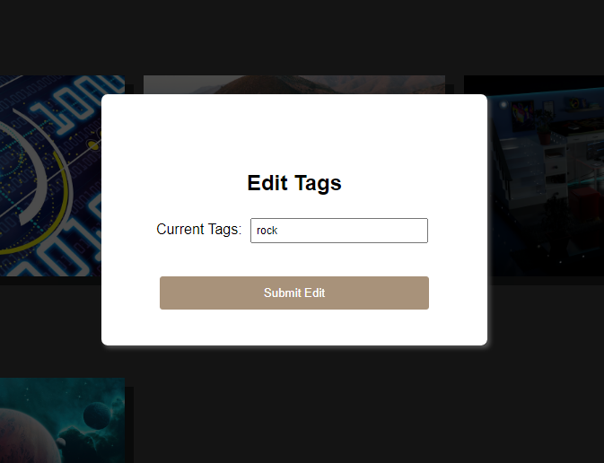

- Delete Image Modal

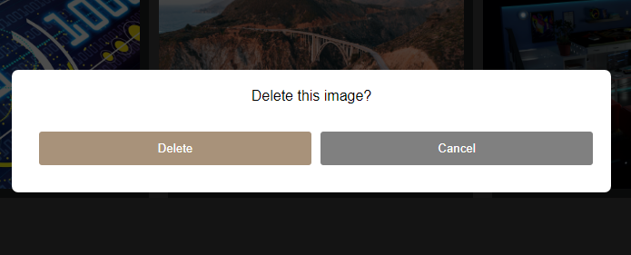

## User Profile & Comments

- Navigating to a User's page (or the User page through the 'Profile' tab) displays their profile card as well as comments left by other users, or the User themselves.

- On this page, users can add a comment, as well as delete comment they've created. The delete button displays only for comments that belong to the logged in user and appears on hover to achieve the clean look of the app.

- In addition, there is a link to that user's uploads below their avatar picture that leads to that profile's uploads. Below the link to their collections, the user's other profile information such as their username, location, and biography are shown.

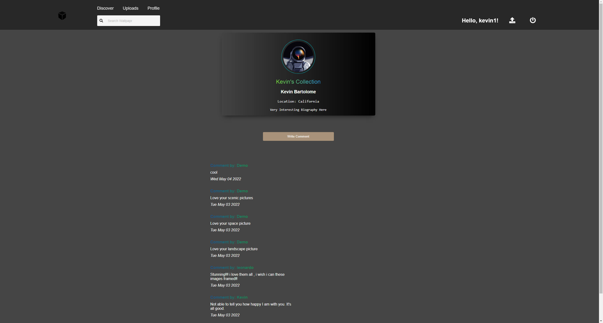

## Search

- There is a search bar at the top that can be used on any page.

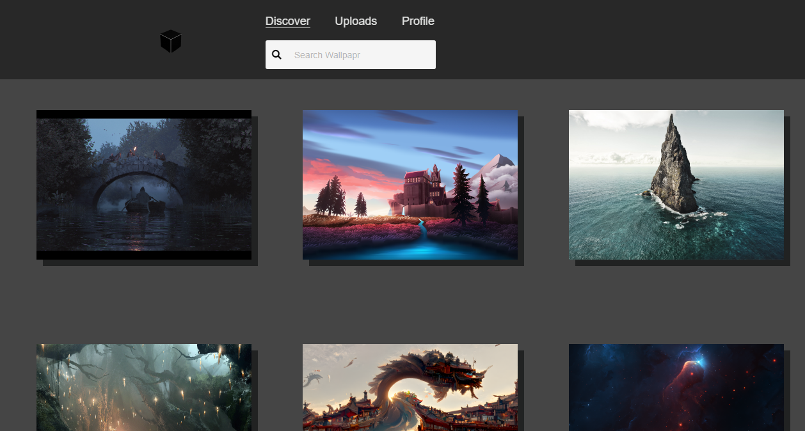

- Users can search for images by putting in a tag in the search bar and any image with that specific tag will show in the results.

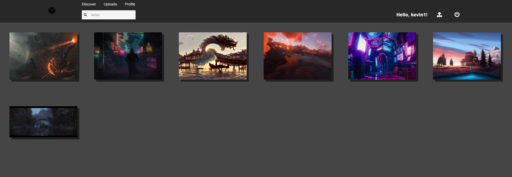

## Page Not Found

- Trying to access a path that does not exist or is not available because the user is not signed in will render a page not found component, and redirects the user to the home page automatically after 10 seconds.

- They will also have the option to return to the home page by clicking the HERE text if they do not want to wait 10 seconds.

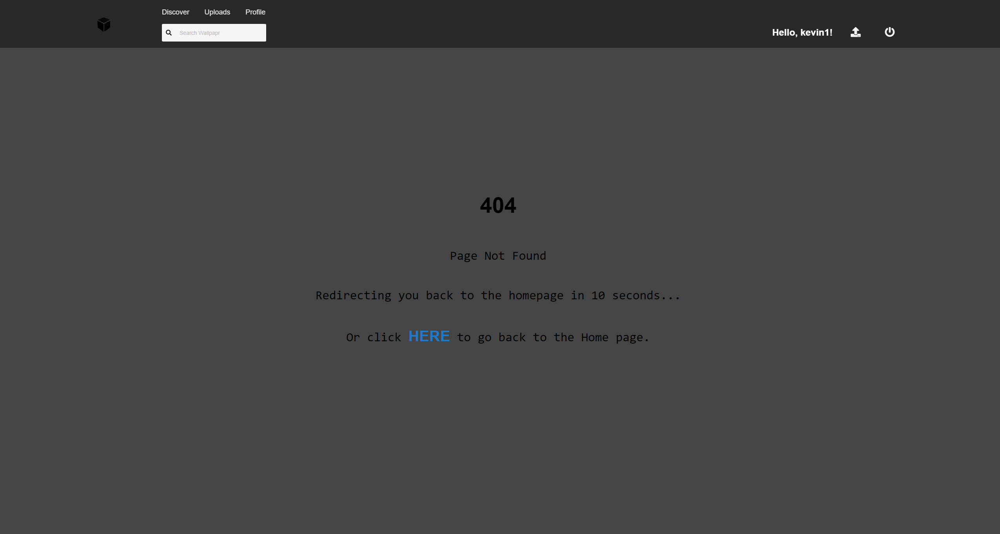
